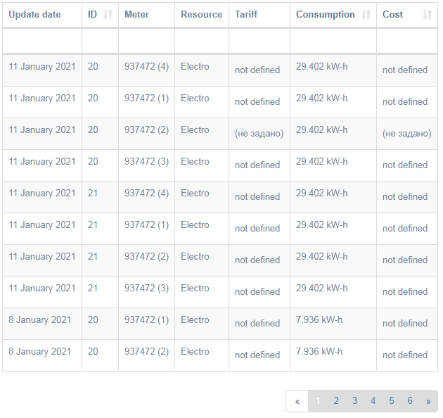
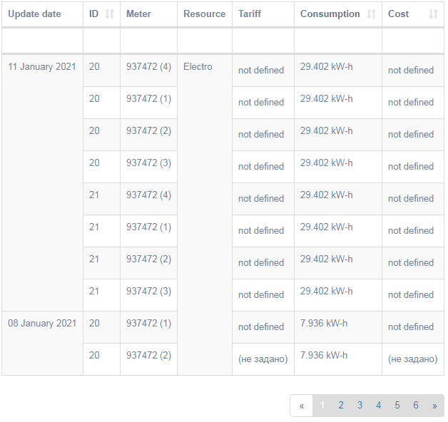

# yii-grid

Merging cells with the same data in yii gridview widgets

How to install:
```
composer require sagittaracc/yii2-grid-merge-cell
```

How to use:

```php
use sagittaracc\grid\MergeDataColumn;

GridView::widget([
  'dataProvider' => $data,
  'columns' => [
    [
      'class' => MergeDataColumn::classname(),
      'attribute' => 'date',
      'label' => 'Update date',
    ],
    ['attribute' => 'id', 'label' => 'ID'],
    ['attribute' => 'SerialNumber', 'label' => 'Meter'],
    [
      'class' => MergeDataColumn::classname(),
      'attribute' => 'Name_Resurs',
      'label' => 'Resource',
      'filter' => [],
    ],
    ['attribute' => 'tarif', 'label' => 'Tariff'],
    ['attribute' => 'ConsumptionDelta', 'label' => 'Consumption'],
    ['attribute' => 'MoneyNotPaidDelta', 'label' => 'Cost'],
  ],
]);
```

From that:



to this:


